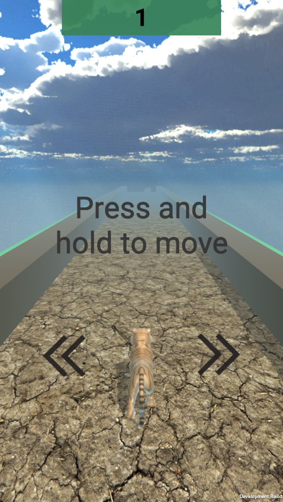
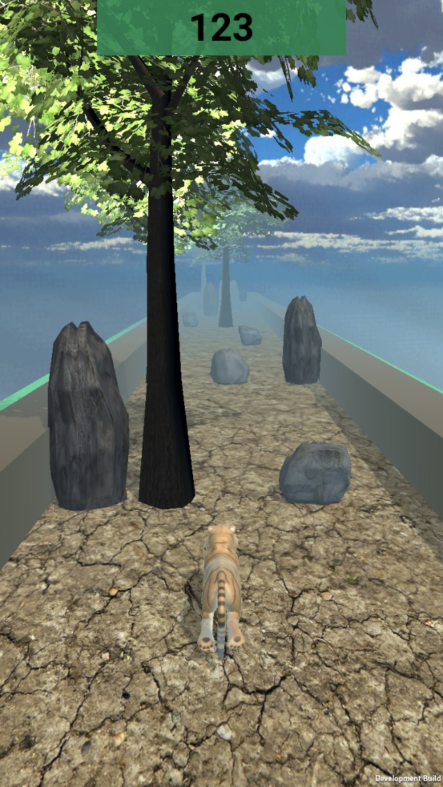

# Forward

A 3D endless runner game in which the player is constantly moving forward while trying to avoid obstacles as the game speed up to beat the high score. The game is initially built for iOS platform. Other platform might be available in the future.

## Getting Started

At the beginning, I came up with an endless runner game idea because it is one of the most popular genres for mobile game due to its addictive nature. The advantage of an endless runner game is that they do not require a lot of update. I did not need to spend time designing different stages or levels for the player to beat. Therefore, it is the best idea to work with since I had limited time to complete the project.

## Learning Process & Experience

The very first thing I have to learn is the Unity editor. It is the main platform that I use to build this project. The three basic components of the editor are (1) the Scene View, which is where I use to design the game map or world, (2) the Game View, the output of the program when it is executed, and (3) the Inspector which allows modification to the Game Object. Getting familiar with the editor also boost up the development process. It allows easier debugging and testing time.

Next, I learn about the Unity API. It provides a lot of useful built-in functions, especially those that involve physics. Understanding the Unity API saves a lot of time in programming the scripts since I can just use the functions instead of implementing it myself.

I also touch a little bit about the UX and UI design. Every games need a way to interact with the player. I learn how to design the most basic yet effective UI which satisfies the player experience while also fullfill its job.

One of the most interesting thing I learn while developing this game is object pool design pattern. Object pool allows me to reuse instead of destroying and recreating the game object which are extremely expensive especially in a high speed game. Since the game is built for mobile, it is important to keep the project size small to optimize the execution speed. Utilizing object pool offers a significant boost in performance.

## Problem Encounter

The first problem that I encounter is the gameplay. How fast should the player be running? Is it too fast which makes the game too difficult or too easy which makes the game boring? To solve these two problems, I perform trial and error testing while also allow other user to play test my game after I finish the first demo version. Does the player have enough time to avoid the obstacles coming their way? Does the game ever get to the state that force the player to lose? To solve all these problems, I need to calculate and factor in the current player forward speed and the sideway speed (left and right) to make sure there is enough room for the player to avoid the obstacles in all cases. The only way for the run to end is if the player reacts too slow and does not make it through the obstacle safely.

The next problem that I face is the physics engine in Unity editor. Some game objects behave like the way I want them to while others are not. I spend most of the time debugging this because there are different problems for different game objects in different scenarios. The reason mostly because there are some features that are not compatible with others, result in weird physics interaction. Sometimes, some features are no longer supported by the Unity version that I use. To solve this, I have to build the objects in other ways that result in the same outcome.

One of the hidden problem that I encounter is float overflow. The Unity game world is built in a world space of x, y, and z axis in which each is represented by a float. In a typical "infinite" runner game, the player will never stop moving forward. There will be a point where the player reaches the end of the game world and causes the program to crash due to float overflow. Though the occasion is very unlikely, but theoretically speaking, it is possible depending on the speed of the player and how the game is implemented. An easy way to solve this problem is instead of moving the player forward, the player will stay static in the origin while the whole environment or the game world will be moving backward. This way, there will never be float overflow problem. When the environment is out of the player's view, it will be "destroy" and put back into the object pool and wait for the next activation.

## Screenshots Demo

  
  
  

## Final Remarks

The reason I choose to build a mobile game as my senior project because it is one of the best way to improve as a student since it requires many different knowledge from variety of study fields such as Math, Physics, Computer Science, Animation, Computer Graphics, etc. Therefore, I figure it will be a nice way to wrap up all the knowledge that I have learned throughout my school years and apply to this project.

## Built With

- Unity 2018.3.4f1 

## Author

- Patrick Quach
